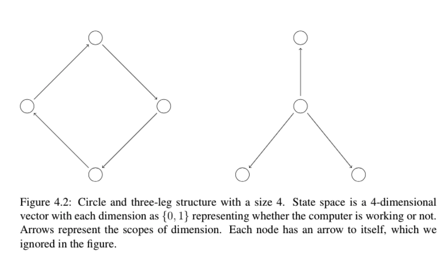
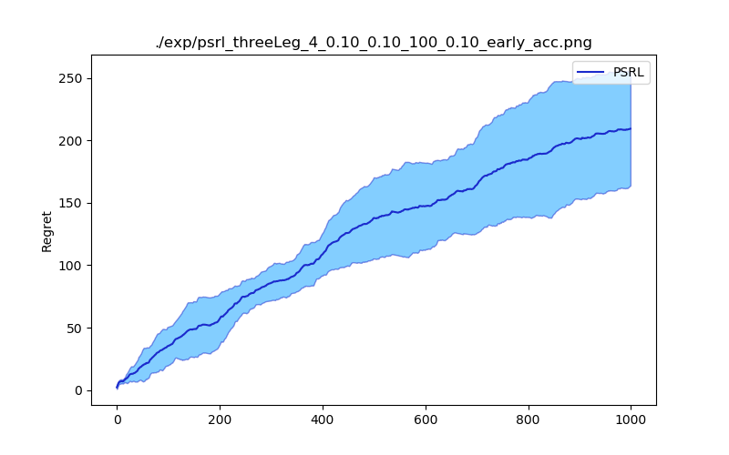

# Factored-MDP-Approximate-Solution

This repository is the code for the paper [Reinforcement Learning in Factored MDPs: Oracle-Efficient Algorithms and Tighter Regret Bounds for the Non-Episodic Setting](https://arxiv.org/pdf/2002.02302.pdf). 

We implemented the approximate solution using the method in [Efficient Solution Algorithms for Factored MDPs](https://www.jair.org/index.php/jair/article/view/10341). The linear programing is solved by calling [Pulp](https://pypi.org/project/PuLP/).

```python
# required Python 3.7
pip install PuLP==2.1
```

## Sample Usage

### Generating a ThreeLeg Environment

```python
from fmdp import *

# generate a threeleg environment

# two parameters for the difficulties of each env
alpha1 = 0.1
alpha2 = 0.1

n_factor_s = 4
n_factor_a = 1; n_state = 2; n_action = n_factor_s + 1

mdp = generate_3leg(n_factor_s, n_factor_a, n_state, n_action, alpha1 = alpha1, alpha2 = alpha2)

# view transition and reward function
mdp.p
mdp.r
```



### Solving FMDP

We compare three solutions here:

1. Accurate solution using LP (Equ (7) in Guestrin 2003)
2. Approximate solution using single basis function without variable elimination
3. Approximate solution using single basis function with variable elimination (Figure 5 in Guestrin 2003)

Single basis function approximate value function using single basis funcitons:
$$
f_i(x) = x_i\\
f(x) = \sum_{i = 1}^m w_i f_i(x)
$$

```python
O = order(mdp) # generate orders for variables elimination

# Accurate solution
mdp.FactoredALP(O, basis = "accurate")
mdp.opt.lp_problem.solve()
lambda_star = mdp.opt.obj.value()

print(lambda_star)

# Approximate solution (fast)
mdp.FactoredALP(O)
mdp.opt.lp_problem.solve()
lambda_app1 = mdp.opt.obj.value()
print(lambda_app1)

# Approximate solution without variable elimination (slow)
mdp.FactoredDirect()
mdp.opt.lp_problem.solve()
lambda_app2 = mdp.opt.obj.value()
print(lambda_app2)
print(lambda_app1 == lambda_app2)
```

## Online Learning using DORL, PSRL and Factored Rmax

Online learning experiments are implemented in ``simple_exp.py``. Three algorithms are implemented:

1. DORL (our method)
2. PSRL
3. Factored Rmax

```python
python simple_exp.py --alg psrl -t 100 -n 5
```

Available hyper-parameters:

```python
parser.add_argument("--alg", help="Algorithms to use: psrl, dorl, rmax", default = "psrl")
parser.add_argument("-p", help="Type of MDP to solve: circle or threeLeg", default = "circle")
# Two parameters for environment generating.
parser.add_argument("-a", help="alpha1", type = float, default = 0.1)
parser.add_argument("-b", help="alpha2", type = float, default = 0.1)

parser.add_argument("-s", help="Number of state factors", type = int, default = 4)

parser.add_argument("-n", help="Number of replicate", type = int, default = 20)
parser.add_argument("-t", help="Numer of steps for each replication", type=int, default = 100)

# Fixed horizon uses the stopping criterion in DORL paper. If it is set False, we use the criterion in Ouyang 2017.
parser.add_argument("-f", help="Whether to use fixed horizon", type = bool, default = False)
parser.add_argument("--acc", help="Whether to use accurate planner to calculate regrets. If it is set False, use approximate planner", type = bool, default = False)

parser.add_argument("--show", help="Show results every `show` steps", type = int, default = 100)
parser.add_argument("--seed", help="Random seed", type = int, default = 1)
parser.add_argument("-d", help="Directory to save results", default = "./exp/")

parser.add_argument("-c", help="Hyper-parameter c for DORL or PSRL", type = float, default = 0.1)
parser.add_argument("-m", help="m for Rmax", type = int, default = 100)

```

Sample output.



